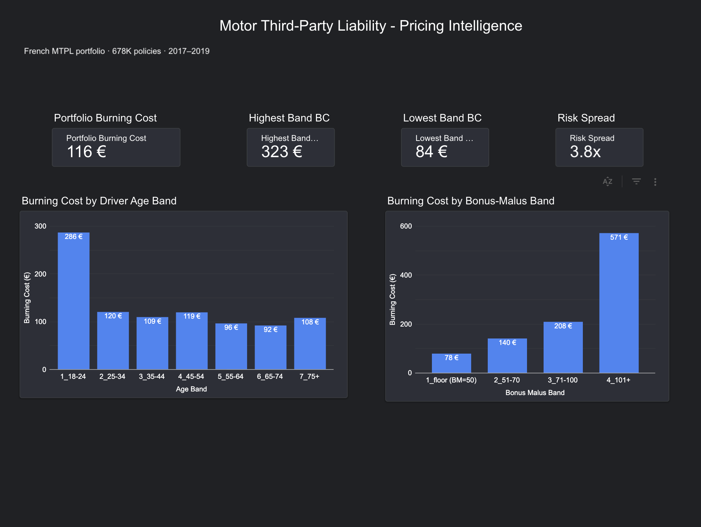
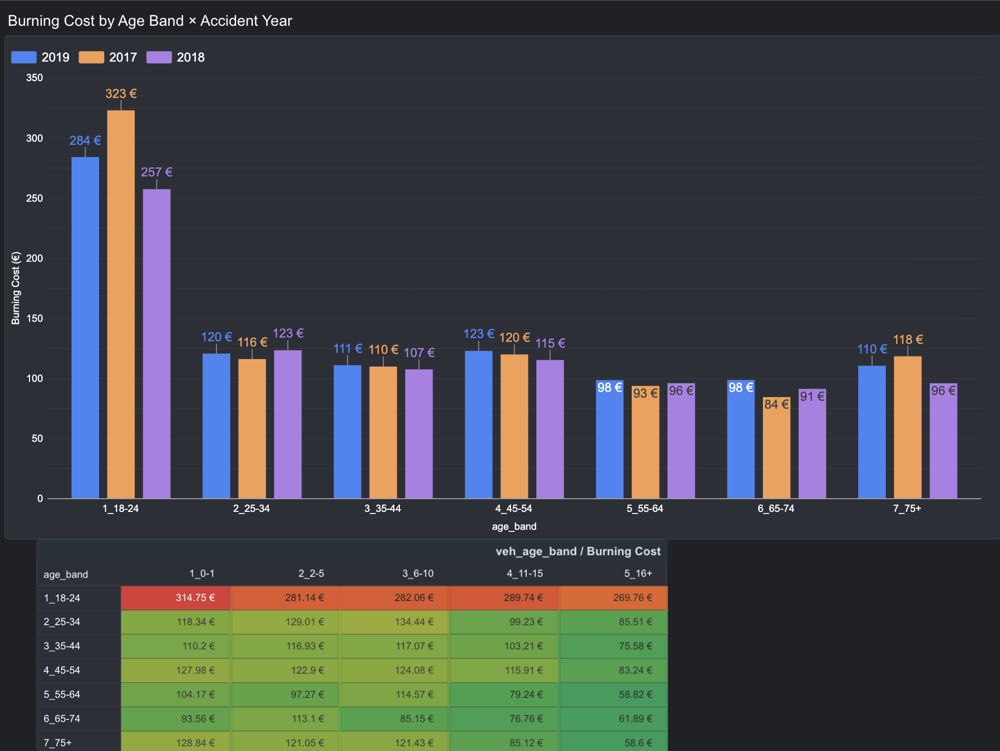
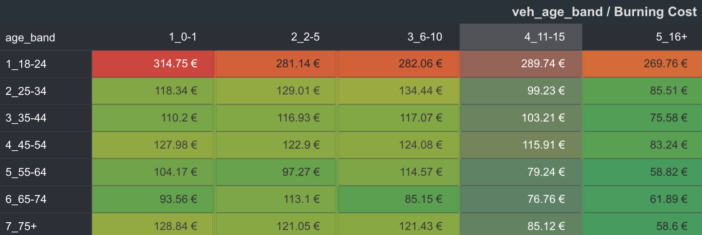

# Motor TPL Pricing Analysis

> **Business question:** Which segments are driving our motor book's loss ratio above target, and what rate change is indicated to bring it back in line?

**Status:** Stage 6 complete — public dashboard published.

A pricing analysis project using the French Motor Third-Party Liability (freMTPL2) dataset. The stack goes from raw CSV → DuckDB → dbt → Dagster → Looker Studio.

---

## Dashboard

**[View the dashboard →](https://datastudio.google.com/reporting/53a0cdc4-9106-4849-b45e-afa3ed74d13d)**

Page 1 is the executive summary — whole-book burning cost and how exposure and claims split across the main rating factors.



The portfolio capped burning cost is **€116 per policy-year**. Most of the book is fine: 57% of policies sit at the BonusMalus floor (BM=50) and average €78/year. The mean is being pulled up by a small high-malus tail.

Page 2 focuses on the two factors that matter most.



Driver age spans a 3.8× range from youngest to oldest band. BonusMalus spans 7.3× — it's the stronger predictor and the main story. Year-on-year the numbers are stable, which rules out a single-year distortion. In the interaction heatmap, driver age drives most of the gradient; vehicle age adds a secondary effect but doesn't change the ranking.



The BM 101+ tail stands out in every age band — that's where the pricing problem is concentrated.

> **Note on the data source:** The dashboard connects to Google Sheets rather than DuckDB directly. Looker Studio needs a cloud-accessible source to generate a public link, and I didn't want to set up hosting infrastructure for a portfolio piece. The numbers are identical — it's a plumbing trade-off for shareability.

---

## Headline findings

| KPI | Value |
|---|---|
| Portfolio capped burning cost | **€116 / policy-year** |
| Youth drivers (18–24) relativity | **2.5–3.0× average** |
| High-malus drivers (BM 101+) relativity | **4.9× average** |

The book is running above target in two segments: young drivers and recently-penalised drivers (BonusMalus > 100). The majority cohort at BM=50 is adequately priced — the loss ratio problem is concentrated in a small tail.

---

## Dataset

**Source:** `freMTPL2freq` and `freMTPL2sev` from the `CASdatasets` R package (Charpentier et al.)
**Size:** 678,013 policies × 26,639 claims
**Period:** Single accident year, French private motor market
**Key variables:** Driver age, BonusMalus coefficient, vehicle age/power/brand, area/region, exposure (fraction of year)

*Raw CSVs are excluded from this repo (see `.gitignore`). Download instructions below.*

---

## Architecture

```
data/raw/                  ← freMTPL2freq.csv, freMTPL2sev.csv (not tracked)
    │
    ▼
DuckDB (mtpl.duckdb)       ← loaded via sql/load_raw.sql; not tracked (reproduced locally)
    │
    ▼
dbt (models/)              ← staging → intermediate → marts
    │
    ▼
Dagster (orchestration/)   ← partitioned assets, data quality checks
    │
    ▼
Looker Studio              ← public dashboard (via Google Sheets export)
```

SQL exploration queries are in `sql/exploration/` (7 files, 01–07).

---

## Methodology notes

**Loss capping at P99 (€16,794)**
Claims are capped before any segment analysis. One catastrophic claim (€4.07M) moved the uncapped youth burning cost from €940 to €286 after capping — a 70% reduction. All segments use the same cap so the comparisons are consistent.

**How bands were chosen**
BonusMalus bands were set after inspecting the empirical distribution. The 101+ band merges four thin sub-bands (101–125, 126–150, 151–200, 200+) that each fell below ~3,000 policies individually. Vehicle age bands (0–1, 2–5, 6–10, 11–15, 16+) were validated with a cell-count check — all 35 age × vehicle-age cells exceed 500 policies. Two thin cells (18–24 × 16+, 75+ × 16+) are flagged in the query comments.

**Data quality**
~195 claims in `raw_sev` have `IDpol` values with no matching policy in `raw_freq`. Kept in portfolio totals, excluded from segment analyses that need a LEFT JOIN to exposure.

**Open question**
The vehicle age effect isn't monotonic. In the 25–34 driver age band, burning cost peaks at VehAge 6–10 rather than falling steadily. Worth discussing with underwriters before using this in a rate change.

---

## Reproduce locally

Requires DuckDB (`brew install duckdb` on macOS).

```bash
# 1. Clone the repo
git clone https://github.com/Taaronn/motor-pricing-analytics.git
cd motor-pricing-analytics

# 2. Download raw data (freMTPL2freq.csv, freMTPL2sev.csv)
#    Source: CASdatasets R package (Charpentier et al.)
#    Place both files in data/raw/

# 3. Load into DuckDB
duckdb mtpl.duckdb < sql/load_raw.sql

# 4. Run a query
duckdb mtpl.duckdb < sql/exploration/01_burning_cost.sql
```

---

## Project structure

```
01-pricing-mtpl/
├── data/
│   └── raw/              ← not tracked (download separately)
├── docs/
│   └── screenshots/      ← dashboard screenshots
├── models/               ← dbt transformation layer
├── orchestration/        ← Dagster pipeline
├── sql/
│   ├── load_raw.sql
│   └── exploration/      ← 7 analytical SQL files
└── README.md
```

---

## Stack

| Layer | Tool |
|---|---|
| Query & storage | DuckDB |
| Transformation | dbt |
| Orchestration | Dagster |
| Dashboard | Looker Studio |
| Language | SQL |
| Version control | Git / GitHub |
